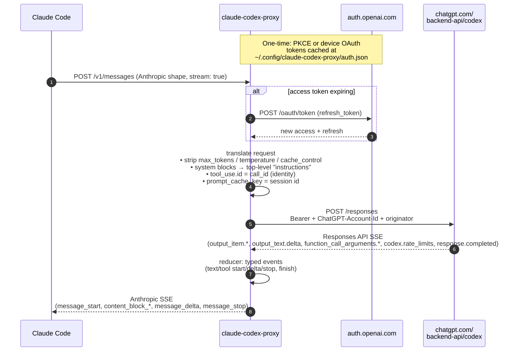

# claude-codex-proxy

`claude-codex-proxy` is a local HTTP proxy that lets
[Claude Code](https://www.anthropic.com/claude-code) call OpenAI's Codex
Responses API using a **ChatGPT Pro/Plus subscription** — no Anthropic API key,
no OpenAI API key.

It translates Anthropic-shaped `/v1/messages` requests to the Responses API,
calls `chatgpt.com/backend-api/codex/responses` with your ChatGPT OAuth token,
and streams the response back in Anthropic SSE format. Claude Code talks to it
over `ANTHROPIC_BASE_URL` and doesn't know the difference.

[Quick start](#quick-start) · [How it works](#how-it-works) ·
[Configuration](#configuration) · [Limitations](#limitations)

## Why?

You're already paying for ChatGPT Plus or Pro. You like the Claude Code UX (TUI,
slash commands, hooks, skills, plugins). This proxy lets you use the former to
pay for the latter — running Claude Code against GPT-5.x through your existing
subscription.

## Quick start

### 1. Install

**Homebrew** (macOS and Linux):

```sh
brew install raine/claude-codex-proxy/claude-codex-proxy
```

**Install script** (macOS and Linux):

```sh
curl -fsSL https://raw.githubusercontent.com/raine/claude-codex-proxy/main/scripts/install.sh | bash
```

**Manual:** download a prebuilt binary for your platform from the
[releases page](https://github.com/raine/claude-codex-proxy/releases).

**From source** (requires [Bun](https://bun.sh) 1.3+):

```sh
git clone https://github.com/raine/claude-codex-proxy
cd claude-codex-proxy
bun install
bun src/cli.ts --version
```

### 2. Authenticate with ChatGPT

Open a browser (PKCE flow):

```sh
claude-codex-proxy auth login
```

Or, on a headless machine (device code flow):

```sh
claude-codex-proxy auth device
```

Either command prints a URL. Sign in with your **ChatGPT Plus/Pro account**. The
access and refresh tokens are stored at
`~/.config/claude-codex-proxy/auth.json` with 0600 permissions.

Verify it stuck:

```sh
claude-codex-proxy auth status
```

### 3. Start the proxy

```sh
claude-codex-proxy serve
```

Defaults to `http://127.0.0.1:18765` (loopback only). Override with
`PORT=11435 claude-codex-proxy serve`.

### 4. Point Claude Code at it

One-shot:

```sh
ANTHROPIC_BASE_URL=http://localhost:18765 \
ANTHROPIC_AUTH_TOKEN=unused \
ANTHROPIC_MODEL=gpt-5.4 \
CLAUDE_CODE_DISABLE_NONESSENTIAL_TRAFFIC=1 \
  claude
```

## Supported models

Set `ANTHROPIC_MODEL` to a model your ChatGPT subscription is allowed to use.
Confirmed working on **Plus**:

- `gpt-5.4`
- `gpt-5.3-codex`

Likely available on **Pro / Enterprise** (not tested by this project, but part
of the Codex CLI allowlist):

- `gpt-5.1-codex`, `gpt-5.1-codex-max`, `gpt-5.1-codex-mini`
- `gpt-5.2`, `gpt-5.2-codex`
- `gpt-5.4-mini`

If you pass a model your account isn't entitled to, upstream returns a 400 like
`"The 'gpt-5.1-codex' model is not supported when using Codex with a ChatGPT account."`
— the proxy surfaces it verbatim.

## How it works



Key decisions:

- **Transport:** HTTP POST (not WebSocket). The backend accepts both; POST is
  simpler and battle-tested by opencode.
- **State:** stateless replay every turn — no `previous_response_id`, no
  `store: true`. Claude Code sends the full history each turn anyway;
  `prompt_cache_key` keyed off `x-claude-code-session-id` lets the upstream
  auto-cache most of it (typically 70%+ hit rate on follow-up turns).
- **Tool IDs:** identity mapping. Anthropic `tool_use.id` = OpenAI `call_id`
  verbatim.
- **Reasoning:** dropped. Responses-style reasoning summaries can't be faked as
  Anthropic `thinking` blocks with valid signatures, so they're omitted.
- **System prompt:** Anthropic `system` blocks are concatenated into the
  Responses API top-level `instructions` field. The rotating
  `x-anthropic-billing-header:` block Claude Code injects is stripped so it
  doesn't invalidate the prompt cache on every turn.
- **Stripped before upstream:** `max_tokens`, `temperature`, `top_p`,
  `cache_control`, `thinking`, `context_management`, `metadata`, and all
  `anthropic-beta` headers.

## Commands

| Command                       | Description                               |
| ----------------------------- | ----------------------------------------- |
| [`serve`](#serve)             | Start the proxy on `PORT` (default 18765) |
| [`auth login`](#auth-login)   | Browser OAuth (PKCE)                      |
| [`auth device`](#auth-device) | Device-code OAuth (headless)              |
| [`auth status`](#auth-status) | Show account ID and token expiry          |
| [`auth logout`](#auth-logout) | Delete the stored auth file               |

---

### `serve`

Starts the HTTP proxy and blocks. Binds to `127.0.0.1` only. Logs to
`$XDG_STATE_HOME/claude-codex-proxy/proxy.log` (rotated at 20 MiB). Set
`CCP_LOG_STDERR=1` to mirror log lines to stderr while running.

```sh
claude-codex-proxy serve
PORT=11435 claude-codex-proxy serve
CCP_LOG_STDERR=1 claude-codex-proxy serve
```

Prints the exact `ANTHROPIC_BASE_URL` / `ANTHROPIC_MODEL` env vars to export on
startup. Refuses to start traffic until `auth login` (or `auth device`) has
stored a token.

---

### `auth login`

Runs the PKCE browser flow against `auth.openai.com` using the Codex CLI's
client ID. Prints a URL, opens a local callback listener on port 1455, waits for
the browser to redirect back, and stores the resulting access / refresh tokens
at `~/.config/claude-codex-proxy/auth.json` (mode 0600). The process exits
automatically once the tokens are saved.

```sh
claude-codex-proxy auth login
```

Sign in with your **ChatGPT Plus/Pro account** — not an OpenAI API account. The
token file includes the extracted `chatgpt_account_id` so the proxy can set the
`ChatGPT-Account-Id` header on every upstream call.

---

### `auth device`

Same OAuth flow, but for headless machines. Prints a short user code and a URL;
you enter the code from any browser on any other device, and the CLI polls
`auth.openai.com` until you authorize, then stores the token.

```sh
claude-codex-proxy auth device
```

Useful over SSH, inside a container, or on any host that can't open a browser.

---

### `auth status`

Shows whether credentials are stored, the account ID, and how long until the
access token expires. Non-zero exit if no auth is present.

```sh
claude-codex-proxy auth status
```

Example output:

```
Account: 79342a5e-57b7-44ea-bfdc-a83ba070dad6
Expires: 2026-04-28T16:46:04.827Z (in 863946s)
File:    /Users/you/.config/claude-codex-proxy/auth.json
```

The proxy refreshes the access token 5 minutes before expiry with a
single-flight guard, so concurrent requests never trigger stampedes of refresh
calls.

---

### `auth logout`

Removes `~/.config/claude-codex-proxy/auth.json`. No server call is needed; the
refresh token just becomes dead.

```sh
claude-codex-proxy auth logout
```

Run `auth login` again to re-authenticate.

---

### Endpoints

The proxy speaks enough of the Anthropic API for Claude Code:

- `POST /v1/messages` — the main turn endpoint (streaming and non-streaming)
- `POST /v1/messages?beta=true` — same (Claude Code always sends `?beta=true`)
- `POST /v1/messages/count_tokens` — local token count via `gpt-tokenizer`
  (o200k_base); used by Claude Code's compaction logic
- `GET /healthz` — liveness check

## Configuration

Settings are environment variables on the proxy process, not a config file.

| Variable          | Default          | Purpose                         |
| ----------------- | ---------------- | ------------------------------- |
| `PORT`            | `18765`          | Proxy listen port               |
| `XDG_STATE_HOME`  | `~/.local/state` | Base dir for `proxy.log`        |
| `CCP_LOG_STDERR` | unset            | Also mirror log lines to stderr |

### Files

- `~/.config/claude-codex-proxy/auth.json` — OAuth tokens, 0600
- `$XDG_STATE_HOME/claude-codex-proxy/proxy.log` — JSON-lines log, rotated at
  20 MiB. Secrets (`authorization`, `access`, `refresh`, `id_token`,
  `ChatGPT-Account-Id`, …) are redacted before write.

### Multiple Claude Codes, one proxy

Several Claude Code instances can share a single proxy. Each request carries its
own `x-claude-code-session-id`, which becomes the upstream `prompt_cache_key`,
so sessions don't poison each other's cache. All sessions draw from the same
ChatGPT rate-limit budget, so be aware that one chatty session affects the
others.

## Limitations

- **Terms of service:** using the Codex backend from a non-official client is
  the same gray area opencode occupies. Use at your own risk.
- **Rate limits:** shared across all clients of your ChatGPT account.
  `codex.rate_limits.limit_reached` is surfaced as HTTP 429 with `retry-after`.
- **Image inputs in tool results:** Responses API `function_call_output` only
  takes a string, so image blocks nested inside `tool_result` are replaced with
  a `[image omitted: <media_type>]` placeholder. Top-level user-message images
  do pass through.
- **Reasoning blocks:** not forwarded to Claude Code (dropped), even if the
  upstream model produced them.
- **Session title generation:** Claude Code's parallel title-gen request is
  forwarded to Codex like any other structured-output request — costs a handful
  of tokens per session rather than being stubbed.
- **OpenAI-flavored `output_config.format`:** translated to Responses API
  `text.format` (json_schema with `strict: true`); other Anthropic-specific
  `output_config` fields are dropped.

## Development

```sh
bunx tsc --noEmit     # typecheck
bun src/cli.ts serve  # run locally
tail -f ~/.local/state/claude-codex-proxy/proxy.log | jq .
```

The core logic lives in:

- `src/translate/request.ts` — Anthropic → Responses API request
- `src/translate/reducer.ts` — Responses SSE state machine (typed events)
- `src/translate/stream.ts` — ReducerEvent → Anthropic SSE
- `src/translate/accumulate.ts` — ReducerEvent → Anthropic JSON (non-streaming)
- `src/codex/client.ts` — bearer + account-id headers, 401 refresh-retry
- `src/auth/manager.ts` — refresh-ahead with single-flight guard

## Credits

The OAuth flow, client ID, endpoint URL, and JWT claim extraction are ported
from [opencode](https://github.com/sst/opencode)'s `codex.ts` plugin.

## Related projects

- [opencode](https://github.com/sst/opencode) — the AI coding agent that proved
  the Codex-via-subscription pattern works in TypeScript
- [claude-history](https://github.com/raine/claude-history) — search Claude Code
  conversation history from the terminal
- [git-surgeon](https://github.com/raine/git-surgeon) — non-interactive
  hunk-level git staging for AI agents
