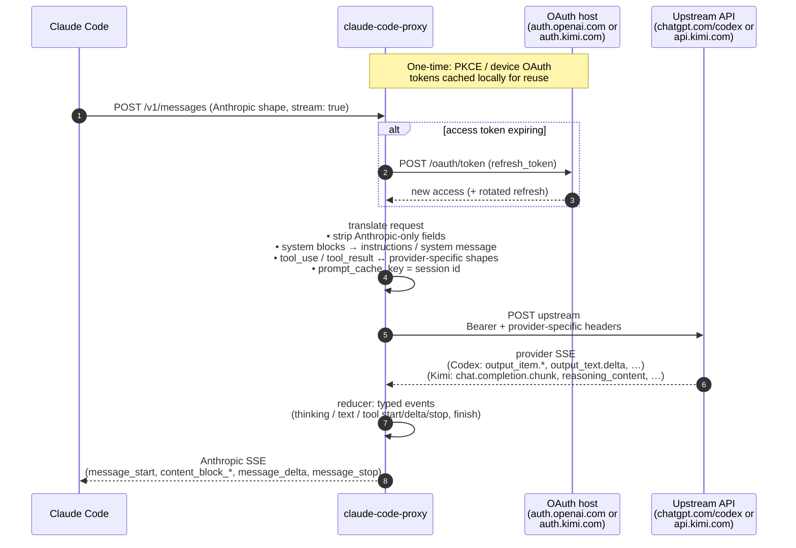

# claude-code-proxy

`claude-code-proxy` lets you use
[Claude Code](https://www.anthropic.com/claude-code) with your **ChatGPT
Plus/Pro** subscription or your **Kimi Code** (kimi.com) account.


[Quick start](#quick-start) · [Providers](#providers) ·
[How it works](#how-it-works) · [Configuration](#configuration) ·
[Limitations](#limitations)

## Why?

I feel Claude Code is still the best harness around, despite occasional
frustrations caused by updates. However, Anthropic keeps tightening the usage
limits, while OpenAI is still much more generous.

If you want to use OpenAI plans, your best options seem to be OpenCode and
Codex. I tried OpenCode, but the UX has many rough edges, especially around
skills feeling like a second-class feature. Fortunately it's open source and I
ended up forking it and applying some patches, but would much rather not do it.

## Quick start

### 1. Install

**Homebrew** (macOS and Linux):

```sh
brew install raine/claude-code-proxy/claude-code-proxy
```

**Install script** (macOS and Linux):

```sh
curl -fsSL https://raw.githubusercontent.com/raine/claude-code-proxy/main/scripts/install.sh | bash
```

**Manual:** download a prebuilt binary for your platform from the
[releases page](https://github.com/raine/claude-code-proxy/releases).

### 2. Pick a provider and authenticate

The proxy supports two upstream providers. Pick one and run its login flow; the
proxy will refuse to start traffic until a token is stored.

**Codex (ChatGPT Plus/Pro):**

```sh
claude-code-proxy codex auth login     # browser OAuth (PKCE)
# or, on a headless machine:
claude-code-proxy codex auth device    # device-code flow
```

Sign in with your **ChatGPT Plus/Pro account**, not an OpenAI API account.

**Kimi (kimi.com Kimi Code):**

```sh
claude-code-proxy kimi auth login      # device-code flow (prints URL + code)
```

Sign in with your **kimi.com account**. The verification URL is displayed; open
it in any browser, confirm the code, and the CLI polls until done.

On macOS credentials go to Keychain; on other platforms they are written to
`~/.config/claude-code-proxy/<provider>/auth.json` (mode 0600).

Verify:

```sh
claude-code-proxy codex auth status
claude-code-proxy kimi auth status
```

### 3. Start the proxy

```sh
claude-code-proxy serve                # listens on 127.0.0.1:18765
PORT=11435 claude-code-proxy serve     # change the listen port
```

Binds to `127.0.0.1` only. One `serve` process handles all providers — the
upstream for each request is chosen from `ANTHROPIC_MODEL`.

### 4. Point Claude Code at it

`ANTHROPIC_MODEL` selects the provider:

- `gpt-5.4`, `gpt-5.3-codex`, `gpt-5.4-mini`, `gpt-5.2` → **codex**
- `kimi-for-coding`, `kimi-k2.6`, `k2.6` → **kimi**

An unknown model returns a 400 listing the supported ids. There is no
implicit default provider.

Claude Code also issues background requests (session title generation, token
counts) against its built-in "small/fast" haiku model id. Those requests
would 400 because no provider claims it, so set
`ANTHROPIC_SMALL_FAST_MODEL` to a concrete id too (the same value as
`ANTHROPIC_MODEL` is usually fine):

```sh
# Codex
ANTHROPIC_BASE_URL=http://localhost:18765 \
ANTHROPIC_AUTH_TOKEN=unused \
ANTHROPIC_MODEL=gpt-5.4[1m] \
ANTHROPIC_SMALL_FAST_MODEL=gpt-5.4-mini[1m] \
CLAUDE_CODE_DISABLE_NONESSENTIAL_TRAFFIC=1 \
  claude

# Kimi
ANTHROPIC_BASE_URL=http://localhost:18765 \
ANTHROPIC_AUTH_TOKEN=unused \
ANTHROPIC_MODEL=kimi-for-coding[1m] \
ANTHROPIC_SMALL_FAST_MODEL=kimi-for-coding[1m] \
CLAUDE_CODE_DISABLE_NONESSENTIAL_TRAFFIC=1 \
  claude
```

Or set it persistently in `~/.claude/settings.json`:

```json
{
  "env": {
    "ANTHROPIC_BASE_URL": "http://127.0.0.1:18765",
    "ANTHROPIC_AUTH_TOKEN": "unused",
    "ANTHROPIC_MODEL": "gpt-5.4[1m]",
    "ANTHROPIC_SMALL_FAST_MODEL": "gpt-5.4-mini[1m]",
    "CLAUDE_CODE_DISABLE_NONESSENTIAL_TRAFFIC": 1
  }
}
```

### 5. Context window size

Claude Code decides auto-compaction based on the model's context window. For
unknown models (like the ones the proxy uses) it defaults to 200K tokens, which
is smaller than what the upstream models actually support (GPT-5.4: 400K+,
Kimi: 256K). This causes auto-compact to fire earlier than necessary.

The `[1m]` suffix on the model name (shown in the examples above) is a Claude
Code convention that tells it to use a 1M-token context window instead. This
raises the auto-compact threshold without disabling it entirely.

If you'd rather disable auto-compact completely, set
`DISABLE_AUTO_COMPACT=1` in your env or `~/.claude/settings.json`. Manual
`/compact` still works, but you risk hitting real upstream limits before
Claude Code can compact for you.

## Toggling between proxy and direct Anthropic

If you still have an Anthropic subscription you want to fall back to, you can
put a small wrapper in front of `claude` that only injects the proxy env vars
when a flag file exists, plus a toggle script to flip the flag. Leave
`~/.claude/settings.json` free of proxy env vars so direct-to-Anthropic remains
the default.

`~/.local/bin/claude` (ahead of the real `claude` on `PATH`):

```bash
#!/bin/bash
# Wrapper that optionally routes to claude-code-proxy.
# Active when ~/.claude/claude-code-proxy-enabled exists.

if [ -f "$HOME/.claude/claude-code-proxy-enabled" ]; then
    export ANTHROPIC_BASE_URL="http://localhost:18765"
    export ANTHROPIC_AUTH_TOKEN="unused"
    export ANTHROPIC_MODEL="gpt-5.4[1m]"
    export ANTHROPIC_SMALL_FAST_MODEL="gpt-5.4-mini[1m]"
    export CLAUDE_CODE_DISABLE_NONESSENTIAL_TRAFFIC="1"
fi

exec "$HOME/.local/bin/claude" "$@"
```

Adjust the exec path if the real `claude` binary lives elsewhere on your
system (e.g. `$(bun pm bin -g)/claude`, `$HOME/.claude/local/claude`).

`claude-proxy-toggle` (anywhere on your `PATH`):

```bash
#!/bin/bash
# Toggle claude-code-proxy routing for the claude wrapper.
set -euo pipefail

flag="$HOME/.claude/claude-code-proxy-enabled"

if [ -f "$flag" ]; then
    rm "$flag"
    echo "proxy: off"
else
    mkdir -p "$(dirname "$flag")"
    touch "$flag"
    echo "proxy: on"
fi
```

Run `claude-proxy-toggle` to flip between routing through the proxy (Codex /
Kimi) and talking to Anthropic directly. New or continued `claude` sessions pick up
the change immediately; existing sessions keep whatever they started with.

## Providers

### Codex (ChatGPT)

Upstream: `https://chatgpt.com/backend-api/codex/responses` (Responses API).

Set `ANTHROPIC_MODEL` to a model your ChatGPT subscription is allowed to use.
Confirmed working on **Plus**:

- `gpt-5.4`
- `gpt-5.3-codex`

Also verified:

- `gpt-5.2`
- `gpt-5.4-mini`

If the resolved model isn't supported by your account, upstream returns a 400
like
`"The 'gpt-4.1' model is not supported when using Codex with a ChatGPT account."`.
The proxy surfaces that verbatim.

Auth:

| Command             | What it does                               |
| ------------------- | ------------------------------------------ |
| `codex auth login`  | Browser OAuth (PKCE) via `auth.openai.com` |
| `codex auth device` | Device-code OAuth for headless machines    |
| `codex auth status` | Show account ID + token expiry             |
| `codex auth logout` | Delete stored credentials                  |

### Kimi (Kimi Code)

Upstream: `https://api.kimi.com/coding/v1/chat/completions` (OpenAI-style
chat-completions).

Only one wire model is exposed: `kimi-for-coding` (its display name in kimi-cli
is **Kimi-k2.6**, 256k context, supports reasoning + image input + video input).
`kimi-k2.6` and `k2.6` are accepted as aliases for the same wire id.

Reasoning effort: Claude Code's `output_config.effort` value (the one you see in
the UI as `◐ medium · /effort`) is forwarded as Kimi's `reasoning_effort` (`low`
/ `medium` / `high`). Thinking blocks from the upstream model are forwarded to
Claude Code and rendered as thinking content. If Claude Code disables thinking,
the proxy drops both `reasoning_effort` and the `thinking: {type: "enabled"}`
flag before forwarding.

Auth:

| Command            | What it does                          |
| ------------------ | ------------------------------------- |
| `kimi auth login`  | Device-code OAuth via `auth.kimi.com` |
| `kimi auth status` | Show user ID + token expiry           |
| `kimi auth logout` | Delete stored credentials             |

## How it works



## Commands

| Command                                             | Description               |
| --------------------------------------------------- | ------------------------- |
| [`serve`](#serve)                                   | Start the proxy on `PORT` |
| `codex auth login` / `device` / `status` / `logout` | Codex OAuth management    |
| `kimi  auth login` / `status` / `logout`            | Kimi OAuth management     |

---

### `serve`

Starts the HTTP proxy and blocks. Binds to `127.0.0.1` only. Logs to
`$XDG_STATE_HOME/claude-code-proxy/proxy.log` (rotated at 20 MiB). Set
`CCP_LOG_STDERR=1` to mirror log lines to stderr while running.

```sh
claude-code-proxy serve
PORT=11435 claude-code-proxy serve
CCP_LOG_STDERR=1 claude-code-proxy serve
```

Prints the supported model → provider mapping on startup. One `serve` process
dispatches to any provider based on the `model` field in each request.
Requests whose model isn't registered with any provider are rejected with
HTTP 400 listing the supported ids.

---

### Codex auth commands

#### `codex auth login`

Runs the PKCE browser flow against `auth.openai.com` using the Codex CLI's
client ID. Prints a URL, opens a local callback listener on port 1455, waits for
the browser to redirect back, and stores the resulting access / refresh tokens
in Keychain on macOS or locally on other platforms. The process exits
automatically once the tokens are saved.

```sh
claude-code-proxy codex auth login
```

Sign in with your **ChatGPT Plus/Pro account**, not an OpenAI API account. The
token file includes the extracted `chatgpt_account_id` so the proxy can set the
`ChatGPT-Account-Id` header on every upstream call.

#### `codex auth device`

Same OAuth flow, but for headless machines. Prints a short user code and a URL;
you enter the code from any browser on any other device, and the CLI polls
`auth.openai.com` until you authorize, then stores the token.

```sh
claude-code-proxy codex auth device
```

Useful over SSH, inside a container, or on any host that can't open a browser.

#### `codex auth status`

Shows whether credentials are stored, the account ID, and how long until the
access token expires. Non-zero exit if no auth is present.

```sh
claude-code-proxy codex auth status
```

Example output:

```
Account: 79342a5e-57b7-44ea-bfdc-a83ba070dad6
Expires: 2026-04-28T16:46:04.827Z (in 863946s)
Storage: macOS Keychain
```

The proxy refreshes the access token 5 minutes before expiry with a
single-flight guard, so concurrent requests never trigger stampedes of refresh
calls.

#### `codex auth logout`

Removes stored auth credentials. On macOS this deletes the Keychain entry. No
server call is needed; the refresh token just becomes dead.

```sh
claude-code-proxy codex auth logout
```

Run `codex auth login` again to re-authenticate.

---

### Kimi auth commands

#### `kimi auth login`

Runs a device-code OAuth flow (RFC 8628) against `auth.kimi.com` using the
kimi-cli client ID. Prints a verification URL and a short user code; open the
URL in any browser, confirm the code, and the CLI polls until the tokens are
issued. Tokens are stored in Keychain on macOS or a mode-0600 file elsewhere.

```sh
claude-code-proxy kimi auth login
```

Sign in with your **kimi.com account**. The access token has a ~15 minute
lifetime; the proxy refreshes it 5 minutes before expiry with a single-flight
guard and persists the rotated refresh token.

A persistent device ID is generated on first login at
`~/.config/claude-code-proxy/kimi/device_id` and reused forever — it's bound
into the issued JWT, so rotating it would invalidate your token.

#### `kimi auth status`

```sh
claude-code-proxy kimi auth status
```

Shows the user ID extracted from the token, expiry time, scope, and storage
backend. Non-zero exit if no auth is present.

#### `kimi auth logout`

```sh
claude-code-proxy kimi auth logout
```

Removes stored auth credentials (Keychain entry on macOS, file elsewhere). Run
`kimi auth login` again to re-authenticate.

---

### Endpoints

The proxy speaks enough of the Anthropic API for Claude Code:

- `POST /v1/messages`: the main turn endpoint (streaming and non-streaming)
- `POST /v1/messages?beta=true`: same (Claude Code always sends `?beta=true`)
- `POST /v1/messages/count_tokens`: local token count via `gpt-tokenizer`
  (o200k_base); used by Claude Code's compaction logic
- `GET /healthz`: liveness check

## Configuration

Settings can come from either environment variables or a `config.json` file.
Precedence per setting: **env var > config file > built-in default**. The
config file is optional — env-var-only setups continue to work unchanged.

The file lives at `~/.config/claude-code-proxy/config.json` on macOS (the same
directory the auth tokens use, deliberately not `~/Library`) and at
`${XDG_CONFIG_HOME:-$HOME/.config}/claude-code-proxy/config.json` elsewhere.

```json
{
  "port": 18765,
  "codex": {
    "originator": "claude-code-proxy",
    "userAgent": "claude-code-proxy/dev",
    "model": "gpt-5.4",
    "effort": "medium"
  },
  "kimi": {
    "userAgent": "KimiCLI/1.37.0",
    "oauthHost": "https://auth.kimi.com",
    "baseUrl": "https://api.kimi.com/coding/v1"
  },
  "log": {
    "stderr": false,
    "verbose": false
  }
}
```

| Variable               | Config key          | Default                          | Purpose                                                                                        |
| ---------------------- | ------------------- | -------------------------------- | ---------------------------------------------------------------------------------------------- |
| `PORT`                 | `port`              | `18765`                          | Proxy listen port                                                                              |
| `XDG_STATE_HOME`       | —                   | `~/.local/state`                 | Base dir for `proxy.log`                                                                       |
| `CCP_LOG_STDERR`       | `log.stderr`        | unset                            | Also mirror log lines to stderr                                                                |
| `CCP_LOG_VERBOSE`      | `log.verbose`       | unset                            | Log full request/response bodies + every SSE event                                             |
| `KIMI_OAUTH_HOST`      | `kimi.oauthHost`    | `https://auth.kimi.com`          | Override Kimi's OAuth host (debugging only)                                                    |
| `KIMI_BASE_URL`        | `kimi.baseUrl`      | `https://api.kimi.com/coding/v1` | Override Kimi's API base URL                                                                   |
| `CCP_CODEX_MODEL`      | `codex.model`       | unset                            | Force all Codex requests to this model (`gpt-5.2`, `gpt-5.3-codex`, `gpt-5.4`, `gpt-5.4-mini`) |
| `CCP_CODEX_EFFORT`     | `codex.effort`      | unset                            | Force all Codex requests to this reasoning effort (`none`, `low`, `medium`, `high`, `xhigh`)   |
| `CCP_CODEX_ORIGINATOR` | `codex.originator`  | `claude-code-proxy`              | Override the `originator` header sent to Codex                                                 |
| `CCP_CODEX_USER_AGENT` | `codex.userAgent`   | `claude-code-proxy/<version>`    | Override the `User-Agent` header sent to Codex                                                 |
| `CCP_KIMI_USER_AGENT`  | `kimi.userAgent`    | `KimiCLI/1.37.0`                 | Override the `User-Agent` header sent to Kimi                                                  |
| `CCP_ORIGINATOR`       | —                   | `claude-code-proxy`              | Fallback for `CCP_CODEX_ORIGINATOR`                                                            |
| `CCP_USER_AGENT`       | —                   | unset                            | Fallback for `CCP_CODEX_USER_AGENT` and `CCP_KIMI_USER_AGENT`                                  |

A malformed `config.json` is reported on stderr and ignored; defaults are used
in its place. Invalid types for individual keys are warned and skipped without
affecting other keys.

### Files

- `$XDG_STATE_HOME/claude-code-proxy/proxy.log` — JSON-lines log, rotated at 20
  MiB. Secrets (`authorization`, `access`, `refresh`, `id_token`,
  `ChatGPT-Account-Id`, …) are redacted before write.
- `~/.config/claude-code-proxy/config.json` (macOS) or
  `${XDG_CONFIG_HOME:-$HOME/.config}/claude-code-proxy/config.json` — optional
  configuration file (see table above).
- `${XDG_CONFIG_HOME:-$HOME/.config}/claude-code-proxy/codex/auth.json` — codex
  tokens (non-macOS; macOS uses Keychain under service
  `claude-code-proxy.codex`). Pre-existing files at the legacy path
  `~/.config/claude-code-proxy/codex/auth.json` are read as a fallback so
  existing logins survive setting `XDG_CONFIG_HOME`.
- `${XDG_CONFIG_HOME:-$HOME/.config}/claude-code-proxy/kimi/auth.json` — kimi
  tokens (non-macOS; macOS uses Keychain under service
  `claude-code-proxy.kimi`). Same legacy-path fallback as above.
- `${XDG_CONFIG_HOME:-$HOME/.config}/claude-code-proxy/kimi/device_id` —
  persistent UUID bound into the Kimi JWT at login. Reused for the lifetime
  of the install.

## Limitations

- **Terms of service:** using the Codex or Kimi backends from a non-official
  client is a gray area. Use at your own risk.
- **Rate limits:** shared across all clients of your upstream account. Codex's
  `codex.rate_limits.limit_reached` and Kimi's HTTP 429 are both surfaced as
  HTTP 429 with `retry-after`.
- **Codex — image inputs in tool results:** Responses API `function_call_output`
  only takes a string, so image blocks nested inside `tool_result` are replaced
  with a `[image omitted: <media_type>]` placeholder. Top-level user-message
  images pass through.
- **Kimi — image inputs in tool results:** pass through as `image_url` parts
  (Kimi accepts them in `role:"tool"` content).
- **Codex — reasoning blocks:** not forwarded to Claude Code (dropped), even if
  the upstream model produced them.
- **Kimi — reasoning blocks:** forwarded as Anthropic `thinking` content blocks
  and rendered by Claude Code. Disable by setting
  `thinking: {"type":"disabled"}` in your Anthropic request.
- **Session title generation:** Claude Code's parallel title-gen request is
  forwarded upstream like any other structured-output request. This costs a
  handful of tokens per session rather than being stubbed.
- **Codex — `output_config.format`:** translated to Responses API `text.format`
  (json_schema with `strict: true`); other Anthropic-specific `output_config`
  fields are dropped.

## Development

```sh
bunx tsc --noEmit                          # typecheck
bun src/cli.ts serve                       # run locally (routes all providers)
tail -f ~/.local/state/claude-code-proxy/proxy.log | jq .
```

**Install a compiled dev build globally:** compile the current working tree to a
binary and place it on your `PATH` without linking:

```sh
mkdir -p ~/.local/bin
bun build ./src/cli.ts --compile --outfile ~/.local/bin/claude-code-proxy
```

## Related projects

- [claude-history](https://github.com/raine/claude-history): search Claude Code
  conversation history from the terminal
- [git-surgeon](https://github.com/raine/git-surgeon): non-interactive
  hunk-level git staging for AI agents
- [workmux](https://github.com/raine/workmux): manage parallel AI coding tasks
  in separate git worktrees with tmux
- [consult-llm](https://github.com/raine/consult-llm): Consult other AI models
  from your agent workflow
