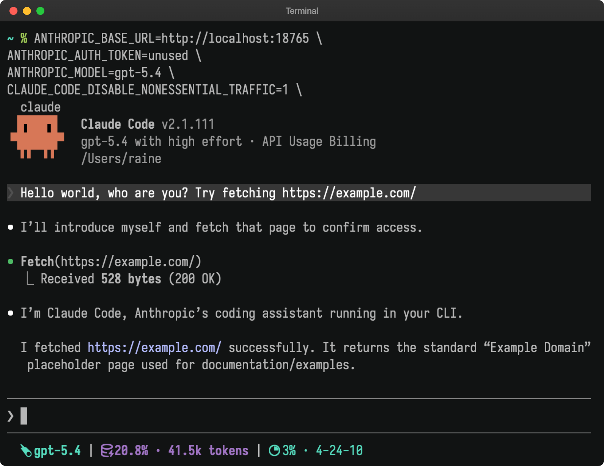
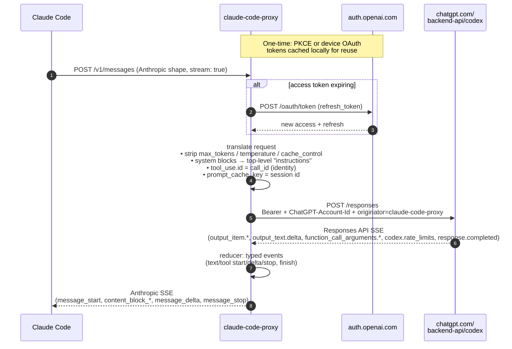

# claude-code-proxy

`claude-code-proxy` lets you use
[Claude Code](https://www.anthropic.com/claude-code) with your ChatGPT Plus or
Pro subscription.



[Quick start](#quick-start) · [How it works](#how-it-works) ·
[Configuration](#configuration) · [Limitations](#limitations)

## Why?

I feel Claude Code is still the best harness around, despite occasional
frustrations caused by updates. However, Anthropic keeps tightening the usage
limits, while OpenAI is still much more generous.

If you want to use OpenAI plans, your best options seem to be OpenCode and
Codex. I tried OpenCode, but the UX has many rough edges, especially around
skills feeling like a second-class feature. Fortunately it's open source and I
ended up forking it and applying some patches, but would much rather not do it.

## Quick start

### 1. Install

**Homebrew** (macOS and Linux):

```sh
brew install raine/claude-code-proxy/claude-code-proxy
```

**Install script** (macOS and Linux):

```sh
curl -fsSL https://raw.githubusercontent.com/raine/claude-code-proxy/main/scripts/install.sh | bash
```

**Manual:** download a prebuilt binary for your platform from the
[releases page](https://github.com/raine/claude-code-proxy/releases).

### 2. Authenticate with ChatGPT

Open a browser (PKCE flow):

```sh
claude-code-proxy codex auth login
```

Or, on a headless machine (device code flow):

```sh
claude-code-proxy codex auth device
```

Either command prints a URL. Sign in with your **ChatGPT Plus/Pro account**. On
macOS, credentials are stored in Keychain. On other platforms, they are stored
locally for reuse by the proxy.

Verify it stuck:

```sh
claude-code-proxy codex auth status
```

### 3. Start the proxy

```sh
claude-code-proxy serve
```

Defaults to `http://127.0.0.1:18765` (loopback only). Override with
`PORT=11435 claude-code-proxy serve`.

### 4. Point Claude Code at it

One-shot:

```sh
ANTHROPIC_BASE_URL=http://localhost:18765 \
ANTHROPIC_AUTH_TOKEN=unused \
ANTHROPIC_MODEL=gpt-5.4 \
CLAUDE_CODE_DISABLE_NONESSENTIAL_TRAFFIC=1 \
  claude
```

Or set it persistently in `~/.claude/settings.json`:

```json
{
  "env": {
    "ANTHROPIC_BASE_URL": "http://127.0.0.1:18765",
    "ANTHROPIC_AUTH_TOKEN": "unused",
    "ANTHROPIC_MODEL": "gpt-5.4",
    "CLAUDE_CODE_DISABLE_NONESSENTIAL_TRAFFIC": 1
  }
}
```

### 5. Optional: disable Claude Code auto-compact

Claude Code decides auto-compaction locally based on the model context window it
thinks it has. If your upstream Codex model supports a larger window than
Claude Code assumes, Claude Code may compact earlier than necessary.

As a workaround, you can disable only automatic compaction and keep manual
`/compact` available:

```sh
DISABLE_AUTO_COMPACT=1 \
ANTHROPIC_BASE_URL=http://localhost:18765 \
ANTHROPIC_AUTH_TOKEN=unused \
ANTHROPIC_MODEL=gpt-5.4 \
CLAUDE_CODE_DISABLE_NONESSENTIAL_TRAFFIC=1 \
  claude
```

Or add it to `~/.claude/settings.json`:

```json
{
  "env": {
    "ANTHROPIC_BASE_URL": "http://127.0.0.1:18765",
    "ANTHROPIC_AUTH_TOKEN": "unused",
    "ANTHROPIC_MODEL": "gpt-5.4",
    "CLAUDE_CODE_DISABLE_NONESSENTIAL_TRAFFIC": 1,
    "DISABLE_AUTO_COMPACT": 1
  }
}
```

Tradeoffs:

- Claude Code will stop proactively compacting before a turn.
- Manual `/compact` still works.
- If you let the session grow too far, you may hit prompt-too-long failures
  instead of a graceful auto-compact.

## Supported models

Set `ANTHROPIC_MODEL` to a model your ChatGPT subscription is allowed to use.
Confirmed working on **Plus**:

- `gpt-5.4`
- `gpt-5.3-codex`

Also verified working on this project:

- `gpt-5.2`
- `gpt-5.4-mini`

The proxy also accepts a small set of convenience aliases and resolves them
before calling the upstream Codex backend:

- `haiku`, `claude-haiku-4-5`, `claude-haiku-4-5-20251001` → `gpt-5.4-mini`
- `sonnet`, `claude-sonnet-4-6` → `gpt-5.4`
- `opus`, `claude-opus-4-7` → `gpt-5.4`

These aliases are only shorthand for portability and cheaper subagent configs;
they are not semantic equivalents of the Claude models they resemble.

If the resolved model isn't supported by your account, upstream returns a 400
like
`"The 'gpt-4.1' model is not supported when using Codex with a ChatGPT account."`.
The proxy surfaces that verbatim.

For example, you can now point Claude Code or a subagent at the proxy with:

```sh
ANTHROPIC_MODEL=haiku claude
```

and the proxy will send `gpt-5.4-mini` upstream.

## How it works



## Commands

| Command                             | Description                               |
| ----------------------------------- | ----------------------------------------- |
| [`serve`](#serve)                   | Start the proxy on `PORT` (default 18765) |
| [`codex auth login`](#auth-login)   | Browser OAuth (PKCE)                      |
| [`codex auth device`](#auth-device) | Device-code OAuth (headless)              |
| [`codex auth status`](#auth-status) | Show account ID and token expiry          |
| [`codex auth logout`](#auth-logout) | Delete stored auth credentials            |

---

### `serve`

Starts the HTTP proxy and blocks. Binds to `127.0.0.1` only. Logs to
`$XDG_STATE_HOME/claude-code-proxy/proxy.log` (rotated at 20 MiB). Set
`CCP_LOG_STDERR=1` to mirror log lines to stderr while running.

```sh
claude-code-proxy serve
PORT=11435 claude-code-proxy serve
CCP_LOG_STDERR=1 claude-code-proxy serve
```

Prints the exact `ANTHROPIC_BASE_URL` / `ANTHROPIC_MODEL` env vars to export on
startup. Refuses to start traffic until `codex auth login` (or `codex auth
device`) has stored a token.

Selects a provider with `CCP_PROVIDER` (default `codex`).

---

### `codex auth login`

Runs the PKCE browser flow against `auth.openai.com` using the Codex CLI's
client ID. Prints a URL, opens a local callback listener on port 1455, waits for
the browser to redirect back, and stores the resulting access / refresh tokens
in Keychain on macOS or locally on other platforms. The process exits
automatically once the tokens are saved.

```sh
claude-code-proxy codex auth login
```

Sign in with your **ChatGPT Plus/Pro account**, not an OpenAI API account. The
token file includes the extracted `chatgpt_account_id` so the proxy can set the
`ChatGPT-Account-Id` header on every upstream call.

---

### `codex auth device`

Same OAuth flow, but for headless machines. Prints a short user code and a URL;
you enter the code from any browser on any other device, and the CLI polls
`auth.openai.com` until you authorize, then stores the token.

```sh
claude-code-proxy codex auth device
```

Useful over SSH, inside a container, or on any host that can't open a browser.

---

### `codex auth status`

Shows whether credentials are stored, the account ID, and how long until the
access token expires. Non-zero exit if no auth is present.

```sh
claude-code-proxy codex auth status
```

Example output:

```
Account: 79342a5e-57b7-44ea-bfdc-a83ba070dad6
Expires: 2026-04-28T16:46:04.827Z (in 863946s)
Storage: macOS Keychain
```

The proxy refreshes the access token 5 minutes before expiry with a
single-flight guard, so concurrent requests never trigger stampedes of refresh
calls.

---

### `codex auth logout`

Removes stored auth credentials. On macOS this deletes the Keychain entry. No
server call is needed; the refresh token just becomes dead.

```sh
claude-code-proxy codex auth logout
```

Run `codex auth login` again to re-authenticate.

---

### Endpoints

The proxy speaks enough of the Anthropic API for Claude Code:

- `POST /v1/messages`: the main turn endpoint (streaming and non-streaming)
- `POST /v1/messages?beta=true`: same (Claude Code always sends `?beta=true`)
- `POST /v1/messages/count_tokens`: local token count via `gpt-tokenizer`
  (o200k_base); used by Claude Code's compaction logic
- `GET /healthz`: liveness check

## Configuration

Settings are environment variables on the proxy process, not a config file.

| Variable          | Default          | Purpose                                            |
| ----------------- | ---------------- | -------------------------------------------------- |
| `PORT`            | `18765`          | Proxy listen port                                  |
| `CCP_PROVIDER`    | `codex`          | Upstream provider (`codex`)                        |
| `XDG_STATE_HOME`  | `~/.local/state` | Base dir for `proxy.log`                           |
| `CCP_LOG_STDERR`  | unset            | Also mirror log lines to stderr                    |
| `CCP_LOG_VERBOSE` | unset            | Log full request/response bodies + every SSE event |

### Files

- `$XDG_STATE_HOME/claude-code-proxy/proxy.log`: JSON-lines log, rotated at 20
  MiB. Secrets (`authorization`, `access`, `refresh`, `id_token`,
  `ChatGPT-Account-Id`, …) are redacted before write.

## Limitations

- **Terms of service:** using the Codex backend from a non-official client is
  the same gray area OpenCode occupies, although OpenAI seems to be cool with
  OpenCode. Use at your own risk.
- **Rate limits:** shared across all clients of your ChatGPT account.
  `codex.rate_limits.limit_reached` is surfaced as HTTP 429 with `retry-after`.
- **Image inputs in tool results:** Responses API `function_call_output` only
  takes a string, so image blocks nested inside `tool_result` are replaced with
  a `[image omitted: <media_type>]` placeholder. Top-level user-message images
  do pass through.
- **Reasoning blocks:** not forwarded to Claude Code (dropped), even if the
  upstream model produced them.
- **Session title generation:** Claude Code's parallel title-gen request is
  forwarded to Codex like any other structured-output request. This costs a
  handful of tokens per session rather than being stubbed.
- **OpenAI-flavored `output_config.format`:** translated to Responses API
  `text.format` (json_schema with `strict: true`); other Anthropic-specific
  `output_config` fields are dropped.

## Development

```sh
bunx tsc --noEmit     # typecheck
bun src/cli.ts serve  # run locally
tail -f ~/.local/state/claude-code-proxy/proxy.log | jq .
```

**Install a compiled dev build globally:** compile the current working tree to a
binary and place it on your `PATH` without linking:

```sh
mkdir -p ~/.local/bin
bun build ./src/cli.ts --compile --outfile ~/.local/bin/claude-code-proxy
```

## Related projects

- [claude-history](https://github.com/raine/claude-history): search Claude Code
  conversation history from the terminal
- [git-surgeon](https://github.com/raine/git-surgeon): non-interactive
  hunk-level git staging for AI agents
- [workmux](https://github.com/raine/workmux): manage parallel AI coding tasks
  in separate git worktrees with tmux
